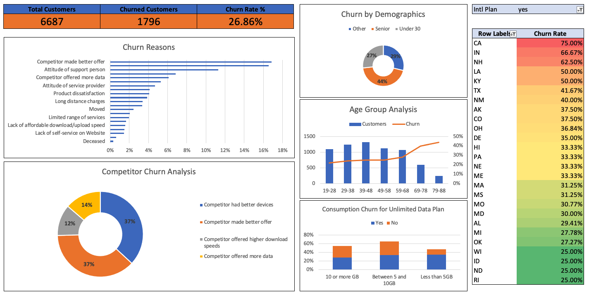

# Customer Churn Analysis using Excel

## Table of Contents
* [Overview](#overview)
* [Problem Statement](#problem-statement)
* [Dataset Details](#dataset-details)
* [Data Preparation](#data-preparation)
* [Analysis Steps](#analysis-steps)
* [Interactive Dashboard](#interactive-dashboard)
* [Key Findings](#key-findings)
* [Recommendations](#recommendations)

## Overview

* This project analyzes customer churn using a fictitious dataset from the telecom provider Databel.
* The objective was to uncover key drivers of churn and provide actionable insights to reduce churn rates.
* Microsoft Excel was utilized for data preparation, analysis, and visualization.

## Problem Statement

* Customer churn is a critical business metric affecting revenue and growth.  
* In this case study, I calculated churn rates, investigated the reasons behind customer churn, and proposed actionable recommendations.

## Dataset Details

**Source**: Databel - Fictitious telecom provider dataset  
**Structure**:
- Two worksheets: `Aggregate` and `Customer`
- 29 columns, 1 row per customer  

**Key Features**:
- `Aggregate Table`: High-level data overview  
- `Customer Table`: Detailed churn behavior

## Data Preparation

1. **Table Conversion**:
   - Converted data ranges into tabular format for consistency
   - Renamed worksheets for simplicity

2. **Duplicate Check**:
   - Used conditional formatting and `Remove Duplicates`

3. **Binary Column Addition**:
   - Added a `Churned` column:  
     - `Yes` → `1`  
     - `No` → `2`

## Analysis Steps

1. **Calculating Churn Rate**:
   - Created PivotTables and used the formula: `(Churned / Total Customers) x 100`  
   - **Result**: 26.86%

2. **Identifying Churn Drivers**:
   - Visualized churn reasons using bar charts  
   - **Key Insight**: Competitors' offers/devices are major churn drivers  

3. **Demographic Analysis**:
   - Categorized customers into groups and found that **Seniors (~40%)** had the highest churn rates.

4. **Consumption Patterns**:
   - Analyzed churn based on data usage; **low data users (<5 GB)** churn at ~35%.

## Interactive Dashboard

### Key Components:
1. **Overview Page**:
   - KPIs: Total Customers, Churned Customers, Churn Rate
   - Visualizations for churn reasons and demographics  

2. **Consumption Analysis**:
   - Filters for top 25 churn-heavy states  
   - Insights on data usage and plan type

3. **Final Insights**:
   - Seniors, low data users, and month-to-month contracts pose the highest risks.

### Dashboard Preview:

*Figure: Interactive dashboard summarizing key insights from the analysis.*

## Key Findings

| Metric                 | Insight                          |
|------------------------|----------------------------------|
| **Churn Rate**         | 26.86% (1,750+ customers)       |
| **Primary Drivers**    | Competitor offers/devices       |
| **Demographics**       | Seniors (~40% churn)            |
| **Low Data Users**     | ~35% churn rate (<5 GB users)   |
| **High-Risk Contracts**| Month-to-month contracts (3+ yrs)|

## Recommendations

1. **Counter Competitor Offers**
   - Identify competitors' offers, pricing, and devices that attract customers.
   - Collaborate with sales and marketing teams to develop counter-strategies:
     - Offer exclusive loyalty discounts or free perks (e.g., data boosts, device upgrades).
     - Partner with device manufacturers to provide competitive or superior hardware options.
     - Highlight unique advantages of existing plans through focused advertising and customer education.

2. **Implement Retention Programs for At-Risk Groups**
   - Senior Citizens:
     - Create senior-friendly plans with simplified features and incentives for long-term loyalty.
     - Offer personalized customer support (e.g., dedicated phone lines).
   - Low Data Users:
     - Develop affordable, tailored plans for customers with low data consumption.
     - Provide occasional free upgrades (e.g., temporary unlimited data) to demonstrate added value.
     - Educate these users on the cost-effective benefits of higher-tier plans.

3. **Promote Long-Term Contracts**
   - Incentivize 1- and 2-year contracts with:
     - Discounted rates, free features (e.g., streaming service subscriptions), or premium customer support.
   - Enable flexible upgrade options within long-term contracts to reduce dissatisfaction over time.
   - Use targeted marketing campaigns to demonstrate cost savings and exclusive benefits of long-term commitments.

4. **Personalize Communication and Engagement**
   - Use data segmentation to craft personalized messages that address individual churn factors (e.g., data limits, contract expiration).
   - Automate notifications and reminders to inform customers about upcoming renewals or plan optimizations.
   - Leverage predictive analytics to identify at-risk customers and initiate tailored retention campaigns proactively.
